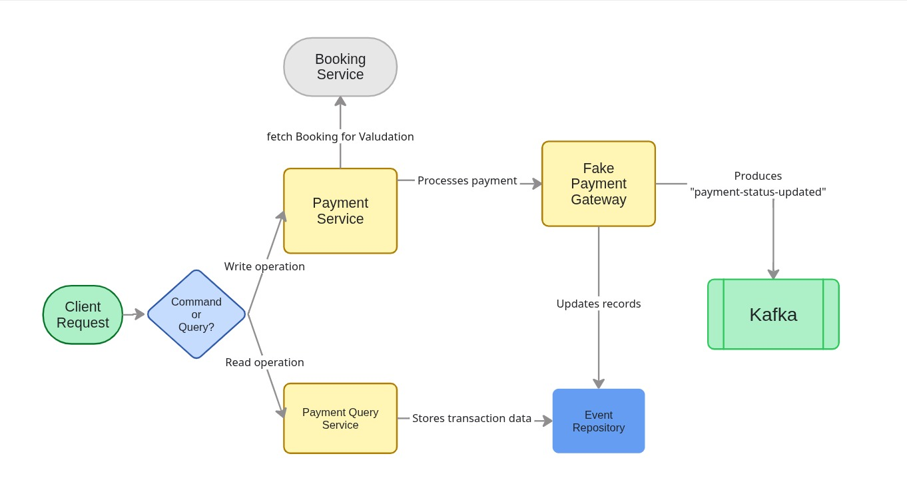

# Payment Service — EventForge Microservice

The **Payment Service** is a core **microservice** within the EventForge ecosystem responsible for **processing payments and managing the payment lifecycle**.

For development purposes, the service exposes a **simulated payment API** that randomly simulates payment outcomes instead of integrating with a real payment gateway.

After every payment attempt, the service publishes a **Payment Status Update Event** to **Apache Kafka**, allowing other microservices (such as the Booking Service) to react asynchronously.

## Features

- **Simulated Payment Processing:** Simulates payment success, failure, or pending status.
- **Random Payment Simulation:** Generates realistic payment results for development and testing.
- **Kafka Event Publishing:** Publishes payment status updates to Kafka.
- **Booking Validation:** Retrieves booking information before creating a payment.
- **Payment History:** Maintains payment status transition history.
- **Idempotent Payments:** Updates existing payments for the same booking instead of creating duplicates.



---

## Payment Flow

The payment lifecycle follows this process:

```text
User initiates payment
        ↓
Booking Service validates booking
        ↓
Payment Service generates simulated payment result
        ↓
Payment is stored
        ↓
Payment Status Event published to Kafka
        ↓
Booking Service consumes event
        ↓
Booking updated accordingly
```

The Payment Service **does not directly update bookings.**

Instead, it publishes an event to Kafka, allowing downstream services to process the payment asynchronously.

---

## Kafka Integration

After processing every payment, the service publishes a message to the Kafka topic:

```text
payment-status-updated
```

Example event:

```json
{
  "paymentId": "uuid",
  "bookingId": "uuid",
  "amount": 4500,
  "status": "SUCCESS"
}
```

This event is consumed by the **Booking Service**, which updates the booking status based on the payment result.

---

## Service Interaction

The Payment Service communicates with other microservices as follows:

```text
User → Payment Service

Payment Service
        ↓
Booking Service (validate booking)

Payment Service
        ↓
Store payment

Payment Service
        ↓
Publish Kafka Event
(payment-status-updated)

Booking Service
        ↓
Consumes payment event
        ↓
Updates booking status
```

---

## Database Design

The Payment Service stores payment transactions and payment history.

### Key Entities

- **Payment**
  - Stores payment information including booking, user, amount, payment method, gateway reference, and status.

- **PaymentHistory**
  - Records every payment status transition for auditing purposes.

- **PaymentStatus**
  - Represents the current payment state.

```text
PENDING
SUCCESS
FAILED
```

- **PaymentMethod**

```text
CARD
UPI
NET_BANKING
WALLET
```

---

## Tech Stack

- **Backend:** Java 21
- **Framework:** Spring Boot
- **Database:** PostgreSQL
- **ORM:** Spring Data JPA (Hibernate)
- **Messaging:** Apache Kafka
- **Authentication:** Keycloak (OAuth2 Resource Server)
- **API Documentation:** OpenAPI / Swagger
- **Containerization:** Docker

---

## API Endpoints

### Payments

| Method   | Endpoint               | Description                      |
| -------- | ---------------------- | -------------------------------- |
| **POST** | `/payment/{bookingId}` | Simulate a payment for a booking |

---

## Simulate Payment

```text
POST /payment/{bookingId}
```

Internal flow:

```text
1 validate booking id
2 fetch booking details from Booking Service
3 randomly generate payment status
4 randomly generate payment method
5 create or update payment
6 save payment history (if updating)
7 publish PaymentStatusUpdateEvent to Kafka
8 return payment response
```

Possible payment statuses:

```text
SUCCESS (≈65%)

FAILED (≈25%)

PENDING (≈10%)
```

Example Response

```json
{
  "paymentId": "uuid",
  "bookingId": "uuid",
  "amount": 4500,
  "status": "SUCCESS",
  "paymentMethod": "CARD",
  "gatewayPaymentId": "7c18c3c2-82d2-4e69-8c4a-34c693f9c0d4"
}
```

---

## Event Driven Communication

Instead of calling the Booking Service directly after processing a payment, the Payment Service publishes an event.

```text
Payment Completed
        ↓
Kafka
(payment-status-updated)
        ↓
Booking Service consumes event
        ↓
Booking status updated
```

This asynchronous communication keeps services loosely coupled and improves scalability.

---

## Role in EventForge Architecture

The **Payment Service** acts as the **payment processor** of the EventForge platform.

```text
Payment Service =
Payment Processing + Kafka Event Publisher
```

It ensures:

- Booking payments are validated
- Payment records are persisted
- Payment history is maintained
- Payment events are published asynchronously
- Other microservices remain loosely coupled through Kafka

---

## Future Improvements

- Integrate with real payment gateways (Stripe, Razorpay, PayPal)
- Payment retry mechanism
- Refund processing
- Dead Letter Queue (DLQ) for failed Kafka events
- Transactional Outbox Pattern
- Saga-based distributed transactions

---

## 👨‍💻 Author

- [@Mukul Daroch](https://github.com/mukuldaroch)
